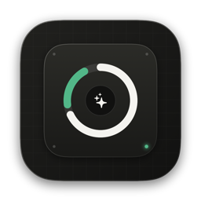

# McClean — Open-Source macOS Storage & Dotfiles Cleaner

<p align="center">
  
</p>

<p align="center">
  <strong>Deep storage reclamation for macOS — hidden dotfiles, 4K/8K aerial wallpapers, AI/LLM caches, and orphaned app leftovers.</strong><br/>
  Built with native SwiftUI, macOS 26+ Liquid Glass, and an offline-first AI Folder Inspector.
</p>

<p align="center">
  <a href="LICENSE"></a>
  
  
</p>

---

## Why McClean?

Most macOS disk cleaners hide behind expensive annual subscriptions while only scanning obvious `~/Library/Caches` folders—missing tens of gigabytes trapped in hidden `~/.dotfiles`, AI model weights, developer caches, and 4K/8K system aerial wallpapers.

**McClean** is 100% open source and built around four core principles:
1. **No Subscriptions, No Paywalls, No Artificial Limits** — Every feature is unlocked out of the box.
2. **Deep Hidden Dotfiles & Wallpaper Discovery** — Finds `~/.wallpaper`, `/Library/Application Support/com.apple.idleassetsd/Customer/4KSDR240FPS`, `~/.ollama`, `~/.cache/huggingface`, `~/.npm`, `~/.cargo`, and unknown hidden dot-directories in `~`.
3. **True Orphaned App Leftover Detection** — Indexes installed `.app` bundles across `/Applications`, `/System/Applications`, and `~/Applications` (by bundle ID, display name, executable, and vendor tokens) and flags only leftover containers/caches from **uninstalled** apps.
4. **AI Folder Inspector** — Explains what any unfamiliar hidden folder is, which application created it, and whether it is safe to delete—using a 100% free offline heuristic engine or optional local Ollama (`http://127.0.0.1:11434`) / OpenAI-compatible endpoints.

---

## Distribution & Supporting the Project

McClean follows an **Open-Source + Mac App Store** model:
- **Free from Source / GitHub Releases**: Clone and build McClean yourself or download from GitHub Releases at zero cost under the [MIT License](LICENSE).
- **Mac App Store**: Prefer 1-click installation, Apple notarization, and automatic App Store updates? Purchase McClean once on the Mac App Store (no subscriptions, no in-app purchases, 100% of features included) to support ongoing development.

---

## Safety & Privacy Architecture

- **Hardcoded Safety Whitelist**: Critical paths (`~/.ssh`, `~/.gnupg`, `~/.aws`, `~/.kube`, `~/.zshrc`, `~/.gitconfig`, `~/Library/Keychains`, `/System`) are permanently locked (`SafetyLevel.protected`) and cannot be selected or deleted even if manually passed to `CleanupService`.
- **TCC-Safe Permission Onboarding**: Never triggers unprompted macOS security popups (`Photos`, `Mail`, `Messages`, `Safari`, `iCloud`). Uses App Store-compliant `NSOpenPanel` security-scoped bookmarks and lets you skip any optional folder (`Downloads`, `Desktop`, `Documents`, `Photos`) while continuing to work seamlessly.
- **Per-Tab Selection Isolation**: Selections are strictly scoped to the active navigation tab so switching modules never causes accidental cross-tab deletions.
- **Immediate Permanent Deletion + Visual Analytics**: Permanently reclaims disk space and renders a post-cleanup category breakdown chart.

---

## Building from Source

### Requirements
- macOS 14.0+ (macOS 26+ recommended for native `GlassEffectContainer` & `.glassEffect` Liquid Glass surfaces)
- Swift 5.9+ / Xcode Command Line Tools

### 1. Build & Package `McClean.app`
```zsh
zsh build_app.sh
open ./McClean.app
```

### 2. Build for Mac App Store (`-DAPP_STORE`)
```zsh
zsh build_app.sh --app-store
```

### 3. Run Automated Verification Suites
```zsh
./McClean.app/Contents/MacOS/McClean --self-test
./McClean.app/Contents/MacOS/McClean --ui-smoke-test
```

---

## License

Released under the [MIT License](LICENSE).
