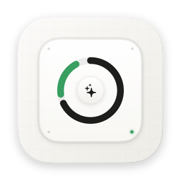

# McClean — Free & Open-Source macOS Storage & Dotfiles Cleaner

<p align="center">
  
</p>

<p align="center">
  <strong>Deep storage reclamation for macOS — hidden dotfiles, 4K/8K aerial wallpapers, AI/LLM caches, and orphaned app leftovers.</strong><br/>
  100% Free & Open Source. Built with native SwiftUI, macOS 26+ Liquid Glass, and an offline-first AI Folder Inspector.
</p>

<p align="center">
  <a href="LICENSE"></a>
  
  
  <a href="https://buymeacoffee.com/alexandrofc"></a>
</p>

---

## Why McClean?

Most macOS disk cleaners hide behind expensive annual subscriptions while only scanning obvious `~/Library/Caches` folders—missing tens of gigabytes trapped in hidden `~/.dotfiles`, AI model weights, developer caches, and 4K/8K system aerial wallpapers.

**McClean** is **100% free and open source**:
1. **Zero Paywalls, Zero Subscriptions** — Every feature is completely free forever, both on GitHub Releases and on the Mac App Store.
2. **Deep Hidden Dotfiles & Wallpaper Discovery** — Finds `~/.wallpaper`, `/Library/Application Support/com.apple.idleassetsd/Customer/4KSDR240FPS`, `~/.ollama`, `~/.cache/huggingface`, `~/.npm`, `~/.cargo`, and unknown hidden dot-directories in `~`.
3. **True Orphaned App Leftover Detection** — Indexes installed `.app` bundles across `/Applications`, `/System/Applications`, and `~/Applications` and flags only leftover containers/caches from **uninstalled** apps.
4. **AI Folder Inspector** — Explains what any unfamiliar hidden folder is, which application created it, and whether it is safe to delete—using a 100% free offline heuristic engine or optional local Ollama (`http://127.0.0.1:11434`) / OpenAI-compatible endpoints.

---

## Support the Project

McClean is developed and maintained for the community at zero cost. If McClean helped you reclaim gigabytes of disk space on your Mac, you can buy the author a coffee:

- ☕ **Buy Me a Coffee:** [https://buymeacoffee.com/alexandrofc](https://buymeacoffee.com/alexandrofc)

---

## Safety & Privacy Architecture

- **Hardcoded Safety Whitelist**: Critical paths (`~/.ssh`, `~/.gnupg`, `~/.aws`, `~/.kube`, `~/.zshrc`, `~/.gitconfig`, `~/Library/Keychains`, `/System`) are permanently locked (`SafetyLevel.protected`) and cannot be selected or deleted.
- **TCC-Safe Permission Onboarding**: Never triggers unprompted macOS security popups (`Photos`, `Mail`, `Messages`, `Safari`, `iCloud`). Uses App Store-compliant `NSOpenPanel` security-scoped bookmarks and lets you skip any optional folder.
- **Immediate Permanent Deletion + Visual Analytics**: Permanently reclaims disk space and renders a post-cleanup category breakdown chart.

---

## Building from Source

### 1. Build & Package `McClean.app`
```zsh
zsh build_app.sh
open ./McClean.app
```

### 2. Build for Mac App Store (`-DAPP_STORE`)
```zsh
zsh build_app.sh --app-store
```

### 3. Run Automated Verification Suites
```zsh
./McClean.app/Contents/MacOS/McClean --self-test
./McClean.app/Contents/MacOS/McClean --ui-smoke-test
```

---

## License & Privacy

- **License:** Released under the [MIT License](LICENSE).
- **Privacy Policy:** McClean collects zero user data and operates 100% locally. Read our full [Privacy Policy](PRIVACY.md).
